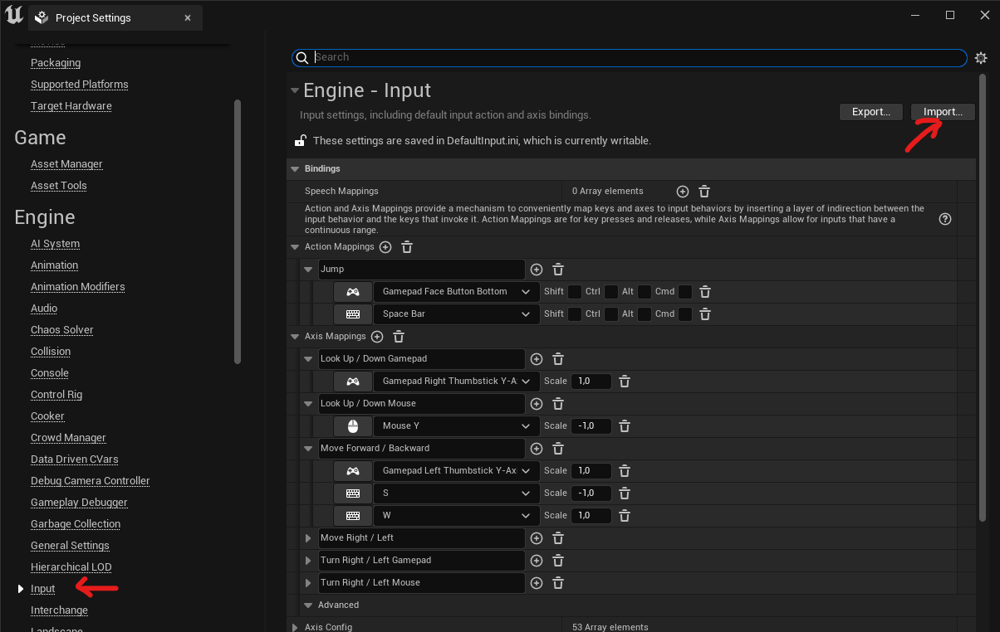

# FAQ
## In the demo level the character does not move.

The demo level uses third person character,but if you do not have well configure de Input the character will not move. To solve this problem I have prepared the file: [InputDemoLevel.ini](code/InputDemoLevel.ini) dowload it to your computer and inside Unreal Engine 5 with your project open go to: Edit->Project Settings->Engine->Input and click on the button "Import..." (top right of the windows). Choose the InputDemoLevel.ini you have downloaded, and the character will move correctly in the demo level.
