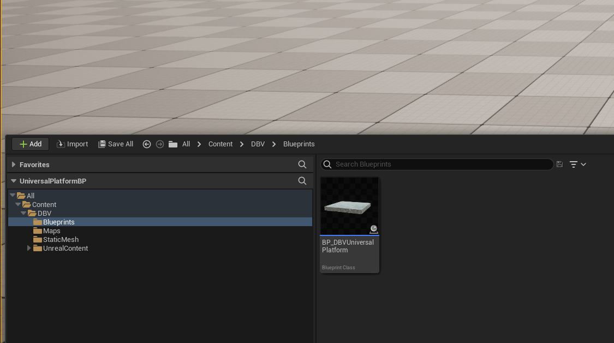
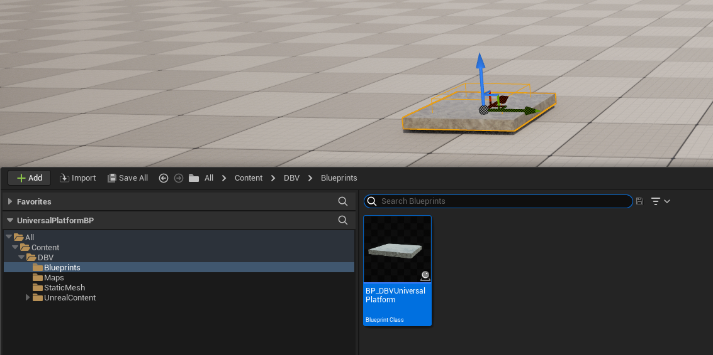
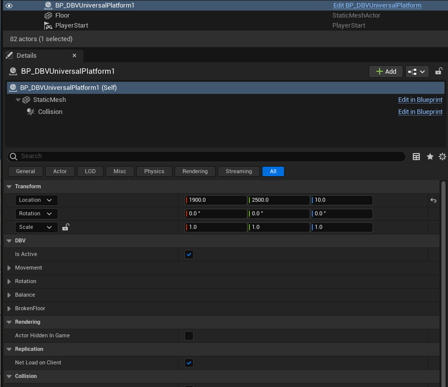
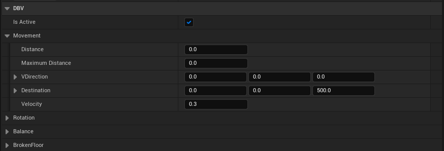
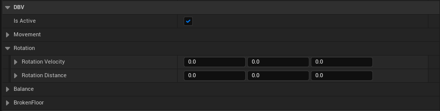
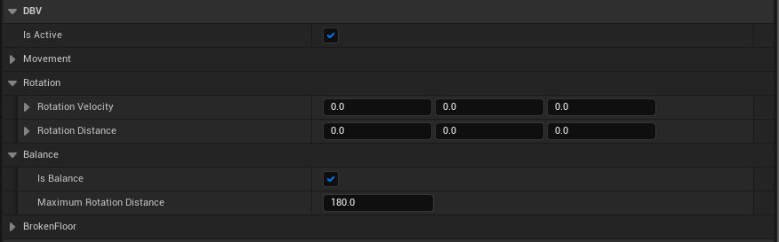
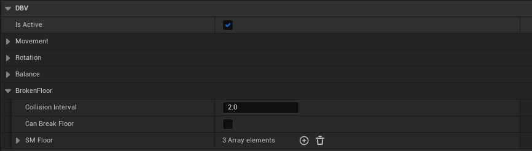
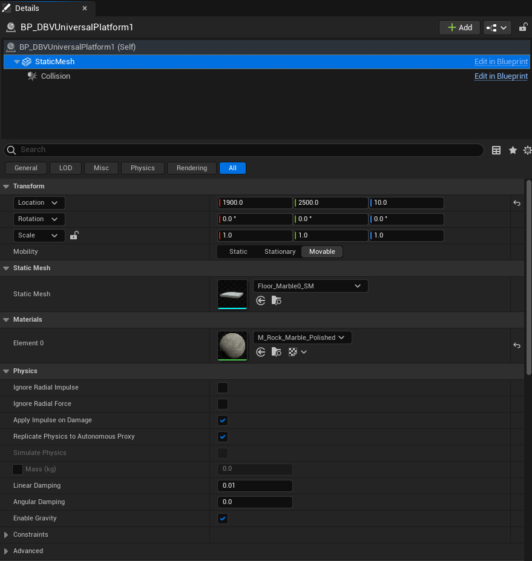
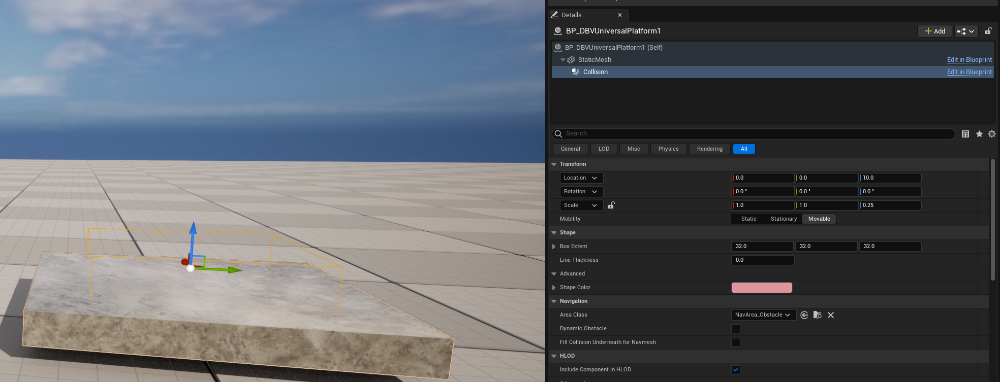

# DBV Universal Platform for Unreal Engine 5
In this repository you find  the Instructions of use of the Blueprint DBV Universal platform available in the Marketplace of Unreal Engine 5. It can be use in platform games like "fall guys" developed in this platform. This code permit to create platforms that moves horizontally or in any direction (ie. doors, elevators, sliding platforms). Also that can turn (discs, obstacles)  or tilt/swing. 

- [DBV Universal Platform for Unreal Engine 5](#dbv-universal-platform-for-unreal-engine-5)
- [Step by step](#step-by-step)
- [Videos](#videos)

# Step by step

In this guide you will learn to use the DBVUniversalPlatform. You can create a new project or use the demoLevel where you can check many examples and see the result of changing the configuration parameters. If you don like to read much, you can check the [Videos](#videos).

When we begin a level with this blueprint installed you will find in the Content Drawer a folder DBV. Inside, in the Content->DBV->Blueprint you will find the BP_DBVUniversalPlatform. 

 If Drag to the scene and you will get the first object as you can see in the next image.
 
If you select the object and then the details section you will find the next image. The name of the object is BP_DBVUniversalPlatform1 (you can rename it) . There you can see a category DBV with four subcategories (Movement, Rotation, Balance and Broken Floor). if the isActive value of the main level is unchecked, all the parameters of the subcategories movement, rotation and balance are ignored.

Let's expland the subcategories to see how they work:
##Movement
If we exam the Movement category we will find some parameters. The two that must be configured are Destination and Velocity. The rest are automatically calculated (but they are editable because you can change them during the execution in the editor to see different results).

We can make that our platform moves in any axis. We will set in Destination the coordinates where we want that the platform moves from its current position. 

If you want to have more control on the movement, for example to make only vertical movements. The recomendation is to copy the current location (as done in the next image) and paste it in the destination vector. 

Then you only need to change the axis that you want. In the example as the original Z=10, as we have put Z=500, it will move only vertically.

The speed of the movement can be set in the parameter Velocity if you set to 0 the platform will not move. Try values above 0.1 to see the result. 
NOTE: The real speed is a product between the paremeter Velocity and the distance, so if distance are to high the velocity should be smaller to avoid that our plaform moves a light speed :-)

##Rotation
If we expand the rotation category we can find two parameters, but the only one we need to change is the Rotation Velocity. The other one will be useful to see how the rotation is happening.
Again you can use only one parameter or change the three. To begin you can try in the third value to put 50 and click play to see how it turn around Z axis. A bigger number will move faster the platform.

##Balance
A balance in a plaform is a platform that rotates using one or more axis but after a number of degress it rotates in the other sense. 
This means that the parameters are the same that for Rotation (RotationVelocity). But you can check if you want rotation with balance in the isBalance check and also you can change the Maximum Rotation Distance. Try values from 20 to 180 to see how it change. 

##Broken floor
In many games you can find platforms that get broken if the character jumps on it. Here all you platforms can have this funcionality. If you want that it can get broken the CanBreakFloor should be checked. The Collision Interval is useful to avoid that a plaform can be broken very fast. If we set this value to 2, this means that after a collision, during 2 seconds it will not break anymore.
Everytime that it brakes, the static mesh shown is changed. The different states are set in the Array SM Floor. By default it is setted with three static mesh that are included in the pack. (3 sets of brokenfloor are available). But you can change as you want. I will publish some videos explaining how to make your own broken floor.

You can personalize the static mesh of your platform and set any static mesh as you can see in the next image. Only select StaticMesh in details, and then change the Static Mesh or the Materials as you want.

If you change your static mesh, probably you need to fix the Collision box. You can do it easily selection Collision and then changing the Scale in Transform.

# Videos

Here you will find the different videos that show how to use it or with examples of use: 

[Demo Level Included in the pack (Third Person view)]( https://youtu.be/PTT5V5t6F9A)

[Tutorial of How to use the Universal Platform.](https://youtu.be/_AtmbjfpMsM)

[Demo Level ang example of a game made with this platform.](https://youtu.be/j6-svHHZjA8)

